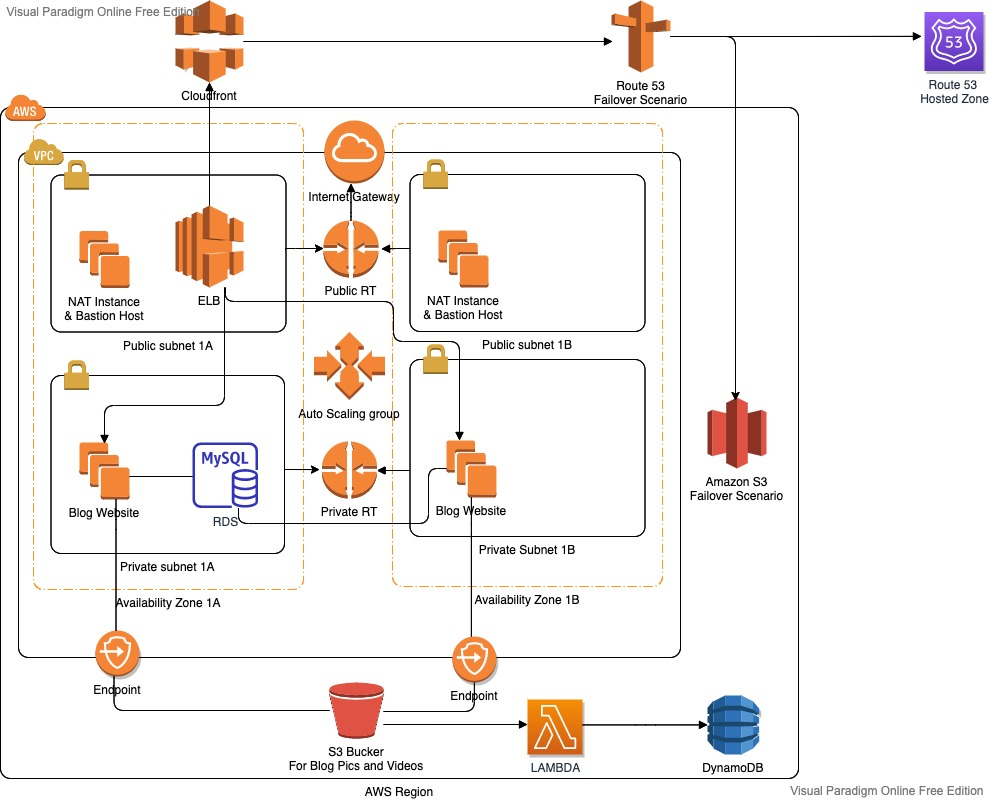
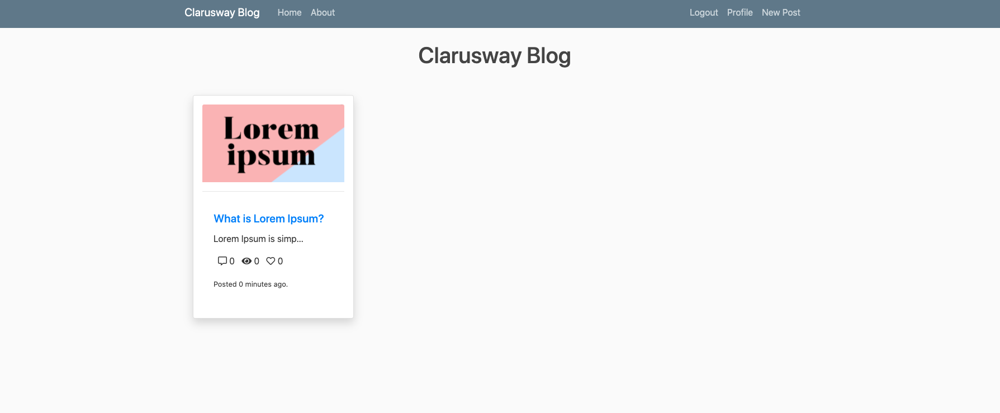

# AWS DevOps Capstone Project

Project Overview

This project demonstrates the deployment of a highly available Django-based blog application on AWS using cloud-native architecture and DevOps best practices.

The solution is designed with scalability, fault tolerance, and security in mind. It leverages multiple AWS services—including Amazon VPC, EC2, Application Load Balancer, Auto Scaling Group, RDS, S3, Lambda, DynamoDB, CloudFront, and Route 53—to build a production-inspired web application infrastructure.

The project also includes deployment automation through an EC2 user data script and serverless processing of S3 object events using AWS Lambda.

## Technologies Used

* AWS EC2
* Application Load Balancer (ALB)
* Auto Scaling Group (ASG)
* Amazon RDS (MySQL)
* Amazon S3
* AWS Lambda
* Amazon DynamoDB
* Amazon CloudFront
* Amazon Route 53
* AWS IAM
* Amazon VPC
* Python Django
* Bash Scripting
* Git & GitHub

## Project Highlights

* Designed a multi-tier AWS architecture using public and private subnets
* Deployed a Django web application on EC2 instances behind an Application Load Balancer
* Configured Auto Scaling Group for high availability and scalability
* Integrated Amazon RDS for relational database management
* Used Amazon S3 for media storage and static failover hosting
* Implemented AWS Lambda to process S3 events and write object metadata to DynamoDB
* Configured CloudFront and Route 53 for secure traffic management and failover
* Automated EC2 application setup using a `userdata.sh` script

## Repository Structure

```text
.
├── S3_Static_Website/      # Static website used for failover scenario
├── src/                    # Django application source code
├── lambda_function.py      # Lambda function for S3 event processing
├── userdata.sh             # EC2 user data script for application setup
├── requirements.txt        # Python dependencies
├── developer_notes.txt     # Application deployment notes
├── capstone.jpg            # Architecture diagram
├── outcome.png             # Expected project outcome
├── Readme_solution.md      # Solution notes
└── README.md               # Project documentation
```

## Deployment Workflow

```text
Developer
      │
      ▼
GitHub Repository
      │
      ▼
EC2 Launch Template
(userdata.sh)
      │
      ▼
Auto Scaling Group
      │
      ▼
EC2 Instances
(Django Application)
      │
      ▼
Application Load Balancer
      │
      ▼
CloudFront
      │
      ▼
Route 53
      │
      ▼
End Users
```

### Supporting Services

* **Amazon RDS** stores application data.
* **Amazon S3** stores media files uploaded by users.
* **AWS Lambda** is triggered by S3 object creation events.
* **Amazon DynamoDB** stores metadata generated by the Lambda function.
* **CloudFront** accelerates content delivery and improves performance.


## AWS Services Used

- VPC
- EC2
- Application Load Balancer
- Auto Scaling Group
- RDS
- S3
- Lambda
- DynamoDB
- CloudFront
- Route 53
- IAM

## My Responsibilities

As part of this project, I was responsible for designing, deploying, and configuring a production-inspired AWS infrastructure by applying DevOps best practices.

My responsibilities included:

* Designed a secure VPC architecture with public and private subnets across multiple Availability Zones.
* Configured networking components including Internet Gateway, NAT, route tables, and security groups.
* Deployed a Django web application on EC2 instances using an Application Load Balancer and Auto Scaling Group.
* Provisioned and integrated an Amazon RDS MySQL database for persistent application data.
* Configured Amazon S3 for media storage and static website failover.
* Developed and configured an AWS Lambda function triggered by S3 events to store object metadata in Amazon DynamoDB.
* Configured Amazon CloudFront and Route 53 to provide secure content delivery and DNS failover.
* Automated EC2 instance provisioning and application deployment using a Bash user data script.
* Managed source code, configuration files, and project documentation using Git and GitHub.


## Architecture Diagram



## Project Outcome



## Future Improvements

This project can be further enhanced by incorporating additional DevOps practices and automation:

* Provision the AWS infrastructure using **Terraform** (Infrastructure as Code).
* Implement a complete **CI/CD pipeline** with Jenkins or GitHub Actions.
* Containerize the Django application using **Docker**.
* Deploy the application to **Amazon EKS (Kubernetes)**.
* Integrate monitoring and alerting with **Amazon CloudWatch**, **Prometheus**, and **Grafana**.
* Implement centralized logging and log analysis.
* Add automated security and vulnerability scanning to the deployment pipeline.

